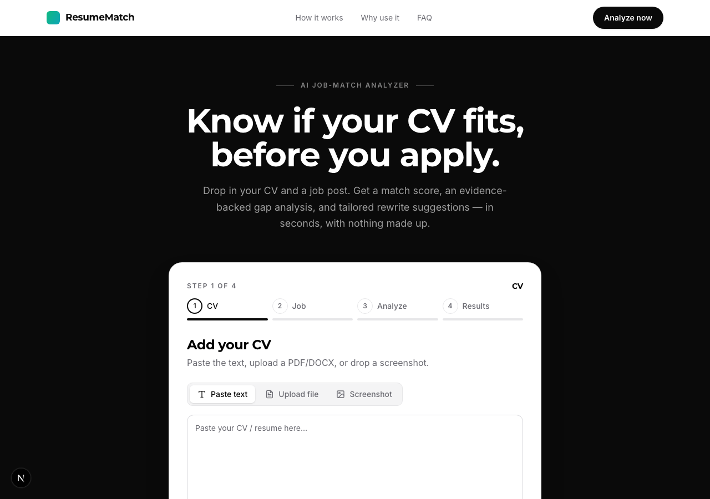
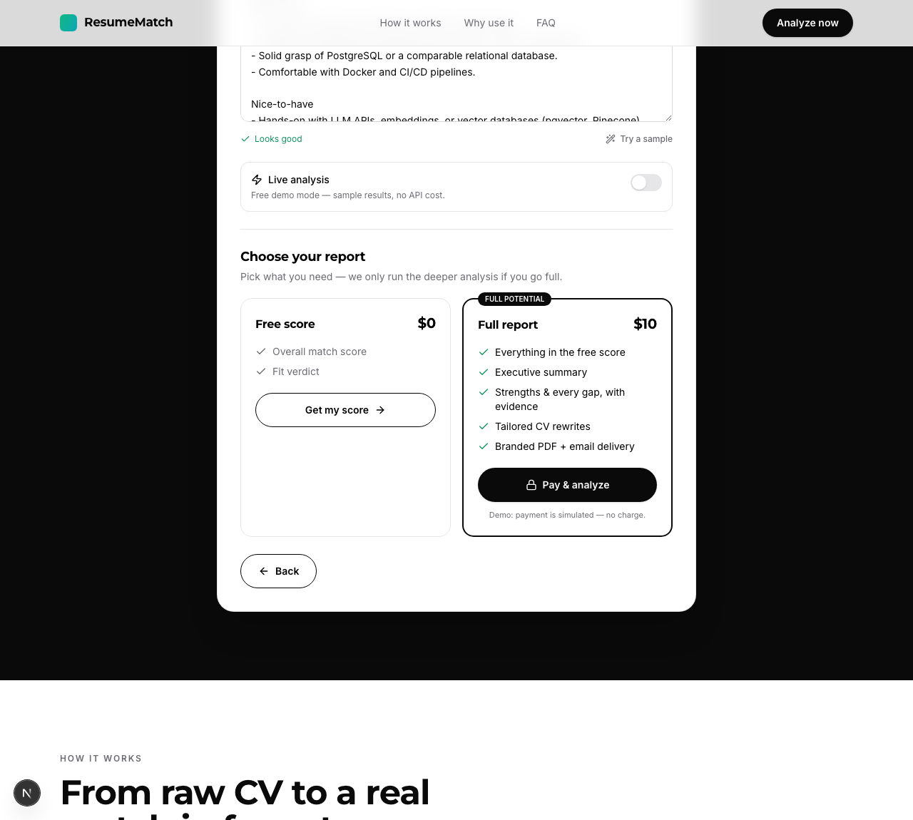
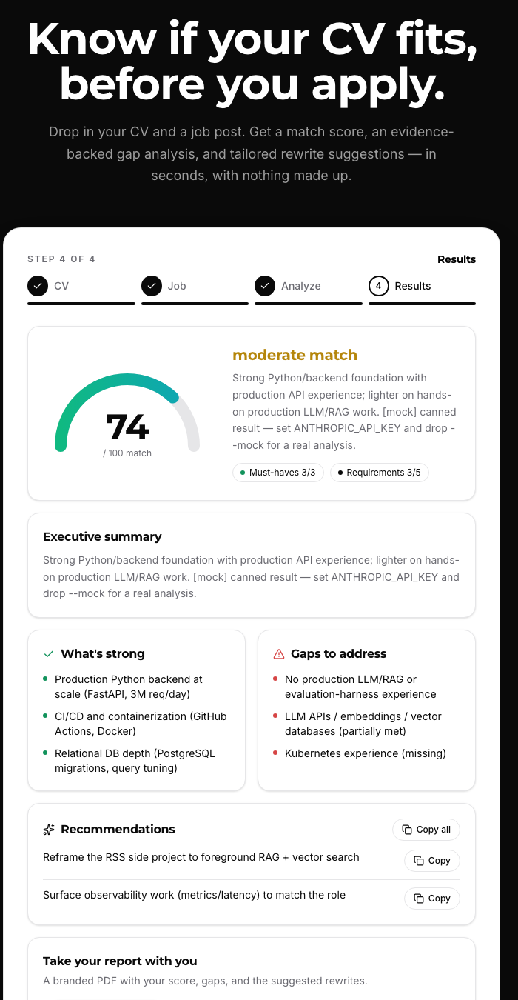
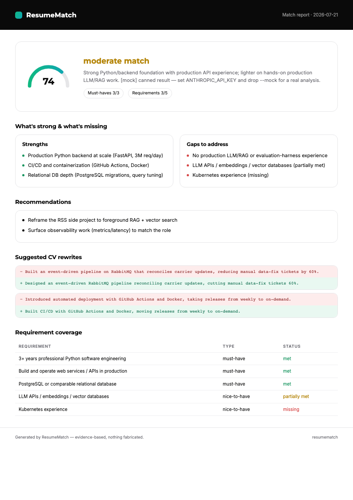
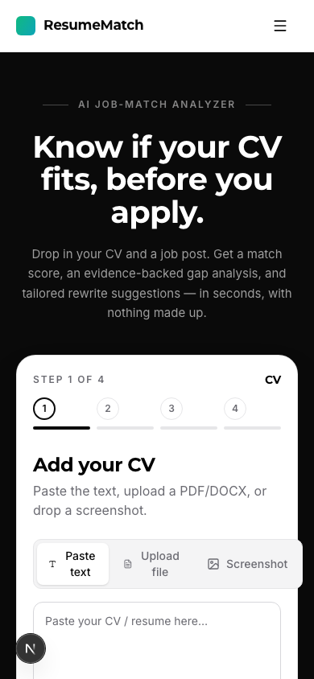

# ResumeMatch

**Find out whether your CV actually fits a job — before you apply.**

Paste a CV and a job posting. ResumeMatch returns a calibrated match score, a gap analysis where
every judgment is backed by a quote from your own CV, and rewritten bullet points tailored to the
role — without inventing a single thing you didn't do.



---

## The problem

"Tailor your CV to every job" is the standard advice, and it's genuinely good advice — it's also
hours of work per application, and most people have no idea *what* to change. Meanwhile automated
screeners reject CVs that don't mirror the posting's language.

The obvious way to solve this with an LLM is also the wrong way: ask a model to rate a CV and it
will happily hallucinate experience, invent metrics, and give everyone a friendly 85%. A tool that
does that is worse than useless — it hands people confidently wrong advice about their careers.

So the interesting engineering problem here isn't "call an LLM." It's **making the output
trustworthy, cheap, and fast enough to actually use.**

## What it does

- **Match score (0–100)** with a calibrated verdict, not flattery
- **Gap analysis** — every requirement tagged `must-have` / `nice-to-have` and `met` / `partially-met` / `missing`, each with the exact CV quote that supports it (or explicitly *no evidence*)
- **Tailored rewrites** — your bullets rephrased in the job's language, with a before/after diff and the reasoning
- **Multi-source input** — paste text, upload PDF/DOCX, drop a screenshot (vision OCR), or hand it a job URL
- **Branded PDF report** you can download or have emailed

| Choose your plan up front | The full report |
|---|---|
|  |  |

## How it works

```
                    ┌─────────────────────────────────────┐
 CV   (text/PDF/    │  input adapters                     │
      DOCX/image) ──▶  pdf · docx · url · vision OCR      │
 Job  (text/PDF/    │  → plain text                       │
      URL/image)  ──▶                                     │
                    └───────────────┬─────────────────────┘
                                    ▼
              ┌──────────────────────────────────────────┐
              │ 1. Claude — scoring + evidence-backed    │  paid + free
              │    gap analysis  (structured output)     │
              ├──────────────────────────────────────────┤
              │ 2. bge-small — requirement ↔ CV chunk    │  local, free
              │    semantic match (on-device)            │
              ├──────────────────────────────────────────┤
              │ 3. Claude — bullet rewriting             │  paid tier only
              │    (structured output)                   │
              └───────────────┬──────────────────────────┘
                              ▼
                    schema-validated Analysis
                    → web UI · JSON · branded PDF
```

At most **two LLM calls** per analysis. Embeddings run on-device, so retrieval costs nothing.

## Engineering decisions worth explaining

**Anti-hallucination is enforced by construction, not by asking nicely.**
The prompt requires an exact CV quote for every requirement it marks as met; anything unsupported
must return `evidence: null`. The Pydantic schema makes that shape mandatory, and the test suite
asserts the invariant (`changed == (rewritten != original)`, missing requirements never carry
evidence). On a live run the model extracted 8 requirements and produced **0 violations**.

**Structured outputs everywhere.**
Claude responses are parsed straight into Pydantic models via `messages.parse`, so malformed output
fails loudly at the boundary instead of leaking into the UI as `undefined`.

**Cost engineering is a feature.**
Claude Haiku 4.5 for the reasoning, `bge-small` locally for retrieval, and the free tier *skips the
rewrite call entirely* (`analyze(with_rewrites=False)`) — so free users cost roughly half of a paid
one. A full analysis lands around **1.5¢**.

**A real mock mode, not a stub.**
The entire product runs end-to-end with `mock=True`: no API key, no spend. It made the whole UI
buildable for free and doubles as an offline test path — the suite runs without touching the API.

**URL extraction that fails loudly.**
Naive whole-page scraping fed a LinkedIn cookie banner into the analyzer and produced a confident,
meaningless score. Extraction now tries schema.org `JobPosting` → known description containers
(LinkedIn, Lever, Greenhouse) → whole-page fallback, and **refuses** to analyze pages that look like
a consent or login wall. Wrong answers are worse than errors.

**The PDF shares the app's design system.**
Rather than a generic PDF library, the report is an HTML template rendered through headless Chromium
— same fonts, same black-and-white identity, same red/green rewrite diffs.



## Evaluation — how I know it's actually good

Eyeballing a few examples is an anecdote. There's a real eval harness (`evals/`) that measures
quality against a fixed golden set, so a prompt change can be *shown* to help or hurt.

- **20-case golden set** where the ground truth is true *by construction* — cases are generated from
  specs, so a CV that uses MongoDB and never says "postgres" **must** return that requirement
  `missing`. It covers strong/weak matches plus the awkward cases: career-changer, sparse CV,
  keyword-stuffed CV, missing must-have, over-qualified, employment gap, non-native-English phrasing.
  Synthetic on purpose — real CVs in a public repo would be personal data.
- **Deterministic checks** (no cost): score-in-band, every cited quote actually present in the CV,
  `missing` requirements carry null evidence, ground-truth statuses hold, no forbidden term fabricated
  into a rewrite.
- **LLM-as-judge** rating faithfulness / evidence quality / calibration / usefulness — and the judge
  is itself **validated**: fed a deliberately fabricated analysis, it correctly returns straight 1/5s.
- **CI-gating runner** that exits non-zero below a pass-rate threshold.

**Baseline (live, 20 cases):** ~88% deterministic pass-rate; judge faithfulness 4.6, evidence 4.75,
calibration 4.75, usefulness 4.0 (out of 5).

**What it caught:** on its first run the harness found the rewrite step *inventing* experience when a
CV was too sparse (only titles + dates). I tightened the rewrite prompt to never add a job term the
original bullet didn't earn; judge faithfulness on those cases went to 5/5. That loop — measure, find
a real failure, fix, re-measure — is the point. See [`evals/README.md`](evals/README.md).

## Tech stack

| Layer | Choice |
|---|---|
| LLM | Claude Haiku 4.5 — structured outputs |
| Retrieval | `BAAI/bge-small-en-v1.5`, on-device via sentence-transformers |
| Backend | FastAPI (Python 3.12), Pydantic v2 |
| Frontend | Next.js 16, React, Tailwind v4, shadcn-style components, framer-motion |
| Input parsing | pypdf · python-docx · httpx + BeautifulSoup · Claude vision |
| Reporting | Headless Chromium (Playwright) → PDF · Resend/SMTP email |

Mobile-first, single high-contrast black-and-white identity (Montserrat + Inter):



## Running it

```bash
# engine + backend
python3.12 -m venv .venv && source .venv/bin/activate
pip install -e ".[dev]"
pip install -r backend/requirements.txt
cp .env.example .env          # add ANTHROPIC_API_KEY for live runs (optional)

uvicorn backend.main:app --reload --port 8000
```

```bash
# web UI (second terminal)
cd frontend && npm install && npm run dev     # http://localhost:3000
```

Runs in **free demo mode** by default — no key required. Flip *Live analysis* in the UI (it's
disabled unless the server has a key) for a real run.

**CLI:**
```bash
python -m resumematch.cli --mock \
  --resume tests/fixtures/sample_resume.txt \
  --job tests/fixtures/sample_job.txt
```

**Tests:** `pytest -q` — 11 tests, fully offline, zero API spend.

**Optional email delivery:** set `RESEND_API_KEY` (or `SMTP_HOST`) and the PDF gets emailed;
otherwise the app says so honestly instead of pretending it sent.

## Project layout

```
resumematch/      analysis engine — schemas, prompts, embeddings, mock mode, CLI
backend/          FastAPI — input adapters, PDF report, email
frontend/         Next.js wizard + landing page
tests/            offline test suite + fixtures
.paul/            project roadmap, decisions, milestone summaries
```

## Honest limitations

- **Payment is simulated.** The $10 tier flips state; there's no Stripe integration, and the paid API endpoints aren't yet gated server-side. Payments + entitlement are the next milestone.
- **Image OCR needs a key** (it's a Claude vision call), so it's stubbed in demo mode.
- **Eval calibration bands are hand-set.** A few scores land just outside them — arguable judgment calls tracked as a backlog in `evals/README.md`, not clear defects.
- **Some job boards block scraping.** LinkedIn job pages work; heavily gated sites don't — the app tells you to paste the text instead.

## Roadmap

- **v0.4 — Eval & LLMOps:** ✅ eval harness shipped (golden set + validated LLM-judge). Next: Langfuse tracing and richer per-analysis cost/latency dashboards.
- **v0.3 — Payments & entitlement:** Stripe Checkout + signature-verified webhook, server-side gating, purchase persistence (the paid endpoints are currently unauthenticated).
- Real payments, persistence of past analyses, live job search

Roadmap and decision history live in [`.paul/`](.paul/ROADMAP.md).
